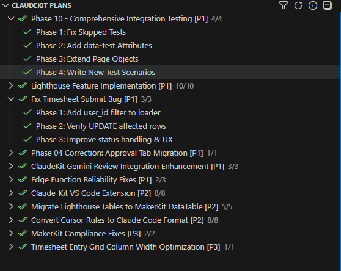

# ClaudeKit Plans

[](https://github.com/darraghh1/claude-kit-vs-extension/releases)

[](LICENSE)

[](https://code.visualstudio.com/)

View ClaudeKit plan progress directly in VS Code. Track phases, priorities, and effort without leaving your IDE.

## What is ClaudeKit?

ClaudeKit is a development workflow system that uses structured markdown plans to organize and track software development projects. Each plan contains phases with status tracking, effort estimates, and metadata - enabling AI-assisted development with clear progress visibility.

This extension brings that visibility directly into VS Code, eliminating the need to switch to web dashboards or manually check plan files.

## Features

- **TreeView Sidebar**: See all plans with phase completion status
- **Status Bar**: Quick glance at current plan progress
- **Auto-Refresh**: Updates automatically when plan files change
- **Rich Metadata**: Displays priority, effort, tags from frontmatter
- **Click to Open**: Navigate directly to plan and phase files
- **Smart Filtering**: Filter by status (Active, In Progress, Pending, Completed)

## Screenshot



*The TreeView sidebar showing plans with status icons, priorities, and progress counts.*

## Installation

### From VSIX (Manual)

1. Download the latest `.vsix` from [Releases](https://github.com/darraghh1/claude-kit-vs-extension/releases)
2. In VS Code, press `Ctrl+Shift+P` → "Extensions: Install from VSIX..."
3. Select the downloaded file

Or via command line:

```bash
code --install-extension claude-kit-vs-extension-0.1.6.vsix
```

### From Source

```bash
git clone https://github.com/darraghh1/claude-kit-vs-extension.git
cd claude-kit-vs-extension
npm install
npm run compile
# Press F5 in VS Code to launch Extension Development Host
```

## Usage

### Viewing Plans

The extension automatically detects plans in `./plans/*/plan.md` and displays them in the Explorer sidebar under "ClaudeKit Plans".

### Plan Structure

Each plan should have:

- `plan.md` - Main plan file with phase table
- `phase-XX-*.md` - Individual phase files (optional)

### TreeView Structure

```
CLAUDEKIT PLANS
├── my-feature (75%) [P1]
│   ├── Phase 1: Database Schema ✓
│   ├── Phase 2: API Endpoints ⟳
│   ├── Phase 3: Frontend Components ○
│   └── Phase 4: Testing ○
└── another-plan (30%)
    ├── Phase 1: Setup ✓
    ├── Phase 2: Core Implementation ○
    └── Phase 3: Documentation ○
```

**Visual indicators:**

- ✓ Completed (green checkmark)
- ⟳ In Progress (yellow sync icon)
- ○ Pending (gray circle)

### Smart Sorting

Plans are automatically sorted by:

1. **Status** - In-progress plans appear first
2. **Priority** - P1 > P2 > P3
3. **Progress** - Higher percentage first
4. **Last modified** - Recent activity first

### Filtering

Click the filter icon in the view header to filter plans:

- **All Plans** - Show everything
- **Active** - In-progress + Pending (hides completed)
- **In Progress Only** - Only work in progress
- **Pending Only** - Not started yet
- **Completed Only** - Finished plans

Filter preference persists across sessions.

### Supported Table Formats

The extension supports 6 table formats for phases:

1. **Standard**: `| Phase | Name | Status | [Link](path) |`
2. **Link-first**: `| [Phase X](path) | Description | Status |`
3. **Number-link**: `| 1 | [Name](path) | Status |`
4. **Simple**: `| 1 | Description | Status |`
5. **Heading**: `### Phase X: Name` with `- Status: ...`
6. **Checkbox**: `- [x] **[Phase 1](path)**`

### Frontmatter

Add YAML frontmatter for rich metadata:

```yaml
---
title: "My Feature Plan"
description: "Brief description for tooltips"
status: in-progress
priority: P1
effort: 4h
tags: [feature, frontend]
branch: feat/my-feature
issue: "#123"
created: 2025-12-15
---
```

### Status Bar

The status bar shows the current active plan:

- Click to open the plan file
- Shows progress percentage (e.g., "3/5 · My Feature")

Priority for current plan selection:

1. Any plan with `in-progress` status
2. Pending plans with some completed phases
3. Most recently modified plan

## Commands

Open Command Palette (`Ctrl+Shift+P`) and type "ClaudeKit":

| Command                      | Description             |
| ---------------------------- | ----------------------- |
| ClaudeKit: Refresh Plans     | Force refresh plan data |
| ClaudeKit: Filter Plans      | Show filter options     |
| ClaudeKit: Show Diagnostics  | Display detection info  |
| ClaudeKit: Open Current Plan | Open the active plan    |

## Settings

| Setting                   | Default   | Description                  |
| ------------------------- | --------- | ---------------------------- |
| `claudekit.plansPath`     | `./plans` | Path to plans directory      |
| `claudekit.showStatusBar` | `true`    | Show status bar item         |
| `claudekit.autoRefresh`   | `true`    | Auto-refresh on file changes |

## Troubleshooting

### Plans Not Showing

1. Run "ClaudeKit: Show Diagnostics" to see detection results
2. Verify plans are in `./plans/*/plan.md` structure
3. Check `claudekit.plansPath` setting if plans are elsewhere

### Status Not Updating

1. Try "ClaudeKit: Refresh Plans" command
2. Verify `claudekit.autoRefresh` is enabled
3. Check file watcher is active in diagnostics

## Development

```bash
# Install dependencies
npm install

# Compile
npm run compile

# Run tests
npm test

# Watch mode
npm run watch

# Package
npx @vscode/vsce package
```

### Architecture

For a detailed walkthrough of how the extension works, see **[ARCHITECTURE.md](ARCHITECTURE.md)**.

```
src/
├── extension.ts              # Entry point - activation, commands, lifecycle
├── types.ts                  # TypeScript interfaces with JSDoc examples
├── treeProvider.ts           # TreeDataProvider for Explorer sidebar
├── statusBar.ts              # Progress display in status bar
├── planProject.ts            # Per-workspace state & file watching
└── parser/
    ├── planParser.ts         # Phase extraction (5 table formats)
    ├── planScanner.ts        # Discovers plan.md files
    ├── metadataExtractor.ts  # YAML frontmatter + header parsing
    └── statusUtils.ts        # Status string normalization
```

**Data flow:** `planScanner` → `metadataExtractor` → `planParser` → `treeProvider` + `statusBar`

All source files are documented with JSDoc comments including `@example` tags for easy onboarding.

## Requirements

- VS Code 1.85.0 or higher
- Workspace with `./plans/*/plan.md` structure

## Contributing

See [CONTRIBUTING.md](CONTRIBUTING.md) for development guidelines.

## License

Public Domain ([Unlicense](LICENSE)) - do whatever you want with this code.